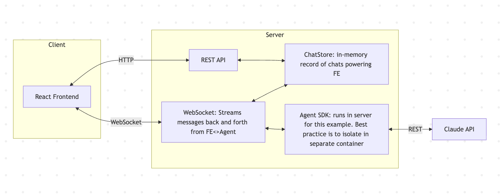

# Simple Chat App

A demo chat application using the Factory Droid SDK with a React frontend and Express backend.



## Getting Started

### Prerequisites

- Node.js 18+
- Factory CLI installed, and authenticated via login or the `FACTORY_API_KEY` environment variable

### Installation

```bash
npm install
```

### Running

```bash
npm run dev
```

This starts both:
- **Backend** (Express + WebSocket) on http://localhost:3001
- **Frontend** (Vite + React) on http://localhost:5173

Open http://localhost:5173 in your browser.

The backend starts a Droid SDK session with the `claude-opus-4-7` model and enables the app's configured tools: `Execute`, `Read`, `Create`, `Edit`, `Glob`, `Grep`, `LS`, and `WebSearch`.

To verify the configured tools are available for the selected model:

```bash
npm run tools:check
```

## Transport

The backend uses the SDK's **daemon mode**: a single `connectDaemon` connection is shared across every chat, and one `droid daemon` process multiplexes all sessions over one WebSocket. Each chat's daemon session id is stored on the chat so a reconnecting session resumes the same agent session (see `server/daemon.ts` and `server/ai-client.ts`). This replaced the earlier exec-mode approach, which spawned one `droid exec` subprocess per chat.

## Production Considerations

This is an example app for demonstration purposes. For production use, consider:

1. **Isolate the Droid SDK** - Run the `droid daemon` as a separate container/service. This provides better security isolation since the agent can access configured tools such as command execution, file operations, and web search. Daemon mode also lets you target a remote/ephemeral machine per session via the `machine` option.

2. **Persistent storage** - Replace the in-memory `ChatStore` with a database. Currently all chats (and the `daemonSessionId` used to resume sessions) are lost on server restart.

3. **Session persistence across restarts** - Resume-by-id works within a running server. To survive a full restart, persist each chat's `daemonSessionId` in the database and resume from it on boot.

4. **Authentication** - Add user authentication and authorization. Currently anyone can access any chat.

## Demo

